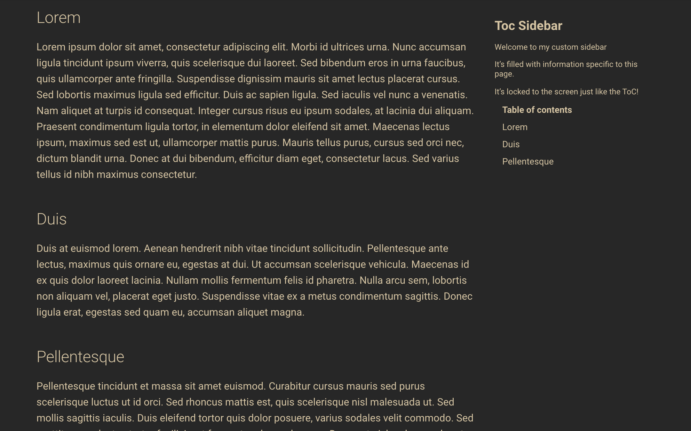

# mkdocs-toc-sidebar-plugin

An MkDocs plugin that allows users to add additional content to the ToC sidebar using the Material theme. 



## Pre-requisites

Currently this plugin will only work with the Table of Contents sidebars in the [Material](https://github.com/squidfunk/mkdocs-material) theme for MkDocs.

## Setup

Install the plugin using pip:

`pip install mkdocs-toc-sidebar-plugin`

Activate the plugin in `mkdocs.yml`:
```yaml
plugins:
  - search
  - toc-sidebar
```

> **Note:** If you have no `plugins` entry in your config file yet, you'll likely also want to add the `search` plugin. MkDocs enables it by default if there is no `plugins` entry set, but now you have to enable it explicitly.

More information about plugins in the [MkDocs documentation][mkdocs-plugins].

## Usage

To add a toc sidebar to one of your markdown pages, simply add a div anywhere in the markdown source like so:

```markdown
<div markdown=1 class="sidebar">
# Toc Sidebar

It's filled with information specific to this page.

It's locked to the screen just like the ToC!
</div>
```

## See Also

More information about templates [here][mkdocs-template].

More information about blocks [here][mkdocs-block].

[mkdocs-plugins]: http://www.mkdocs.org/user-guide/plugins/
[mkdocs-template]: https://www.mkdocs.org/user-guide/custom-themes/#template-variables
[mkdocs-block]: https://www.mkdocs.org/user-guide/styling-your-docs/#overriding-template-blocks
